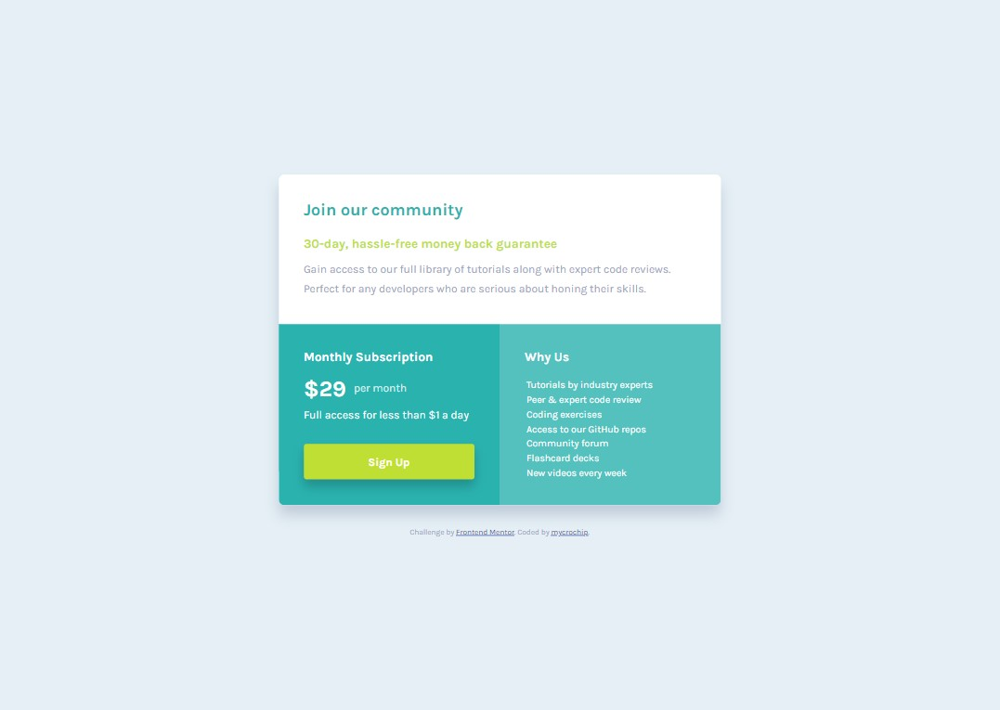

# Frontend Mentor - Single price grid component solution

This is a solution to the [Single price grid component challenge on Frontend Mentor](https://www.frontendmentor.io/challenges/single-price-grid-component-5ce41129d0ff452fec5abbbc). Frontend Mentor challenges help you improve your coding skills by building realistic projects. 

## Table of contents

- [Overview](#overview)
  - [The challenge](#the-challenge)
  - [Screenshot](#screenshot)
  - [Links](#links)
- [My process](#my-process)
  - [Built with](#built-with)
  - [What I learned](#what-i-learned)
  - [Continued development](#continued-development)
- [Author](#author)


## Overview

### The challenge

Users should be able to:

- View the optimal layout for the component depending on their device's screen size
- See a hover state on desktop for the Sign Up call-to-action

### Screenshot

#### Moble View - 375px


#### Tablet View - 600px


#### Desktop VIew - 960px



### Links

- Solution URL: [GitHub](https://github.com/mycrochip/single-price-grid-component.git)
- Live Site URL: [GitHub Pages](https://mycrochip.github.io/single-price-grid-component/)


## My process

### Built with

- Semantic HTML5 markup
- CSS custom properties
- CSS Grid


### What I learned

I got to make use of the &lt;pre&gt; tag for preformatted text. I saw first-hand the nuances of the tag - the numerous default stylings waiting to be overridden and its merits and demerits.

```html
<pre class="section--3__text">
  Tutorials by industry experts
  Peer &amp; expert code review
  Coding exercises
  Access to our GitHub repos
  Community forum
  Flashcard decks
  New videos every week</pre>  <!--Adding a 'return' here means you want a new block of line-->
```


### Continued development

More projects to be completed on [FrotendEnd Mentor](https://www.frontendmentor.io/)


## Author

- Frontend Mentor - [@mycrochip](https://www.frontendmentor.io/profile/mycrochip)
- Twitter - [@mycrochip_world](https://www.twitter.com/mycrochip_world)